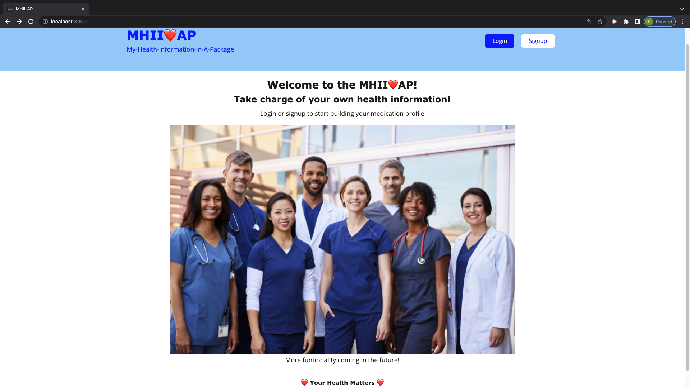
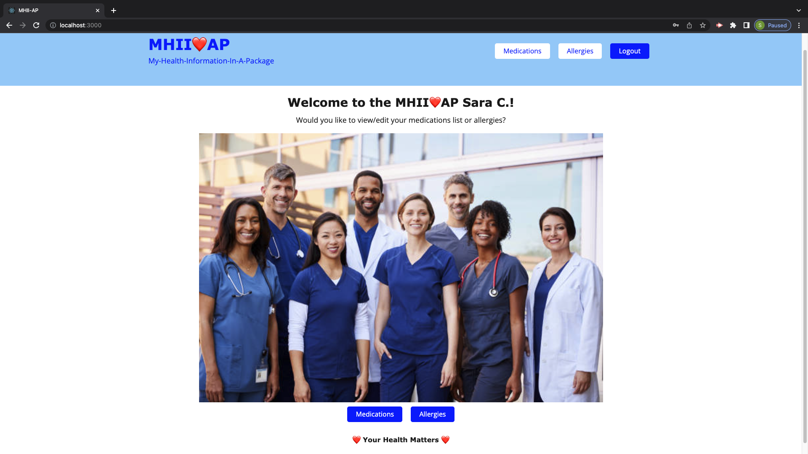
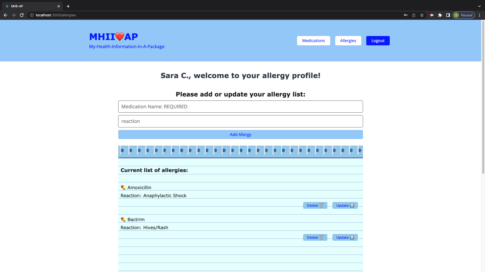

# Project-3-MHII-AP[](https://opensource.org/licenses/MIT)

## Description

The following project is MERN stack app that allows users to created and modify their own medication lists and allergy lists.

The motivation for this project is a result of hearing about an integrated health information system that will allow all providers to access the most accurate and currently health information on their patients in order to provide the best care possible for over 15 years and still not seeing this application. Currently this application is only for the patient and thier medications but the hope is to include a provider portal and other medical information.

### User Story:

```
AS a healthcare provider
I want patients to have a tool that will allow them to take some responsibility for their own health.
I also want patients to able to easily present their provider with their own medical profile (currently only medications)
I want patients to be able to easily modify their own health profile to reflect their current health status (the delete and update functionality is still in progress).
```

## Table of Contents

- [Installation](#installation)

- [Usage](#usage)

- [License](#license)

- [Collaborators](#collaborators)

- [Questions](#questions)

## Installation

### To install necessary dependencies, run the following command:

```
npm i
```

## Usage

- https://mhii-ap.herokuapp.com/

|           |  |
| :----------------------------------------: | :-------------------------------------: |
|  |  |

## License

This project is licensed under the MIT license.

## Collaborators

```
Sara Chen

```

## Questions

If you have any questions about the repository, please open an issue or contact us directly at:

- csara@gmail.com

You can find more of our work at:

- https://github.com/csara715
